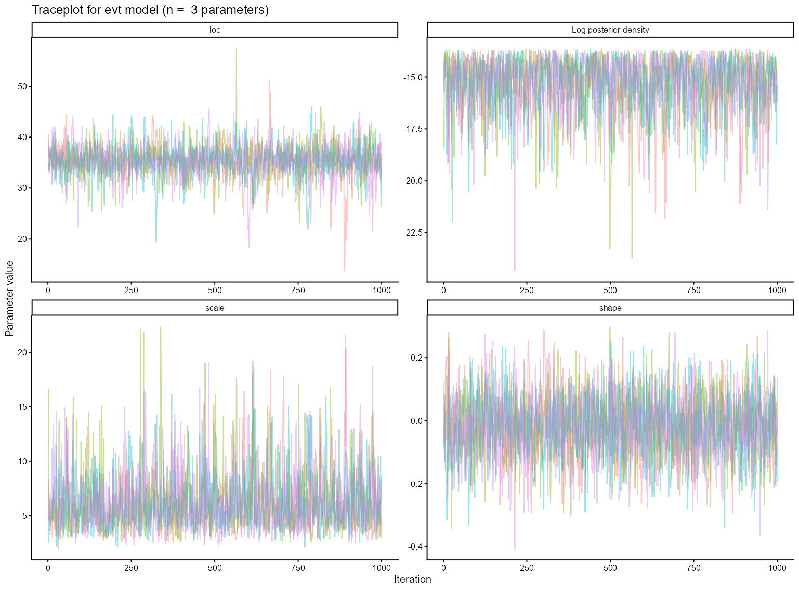
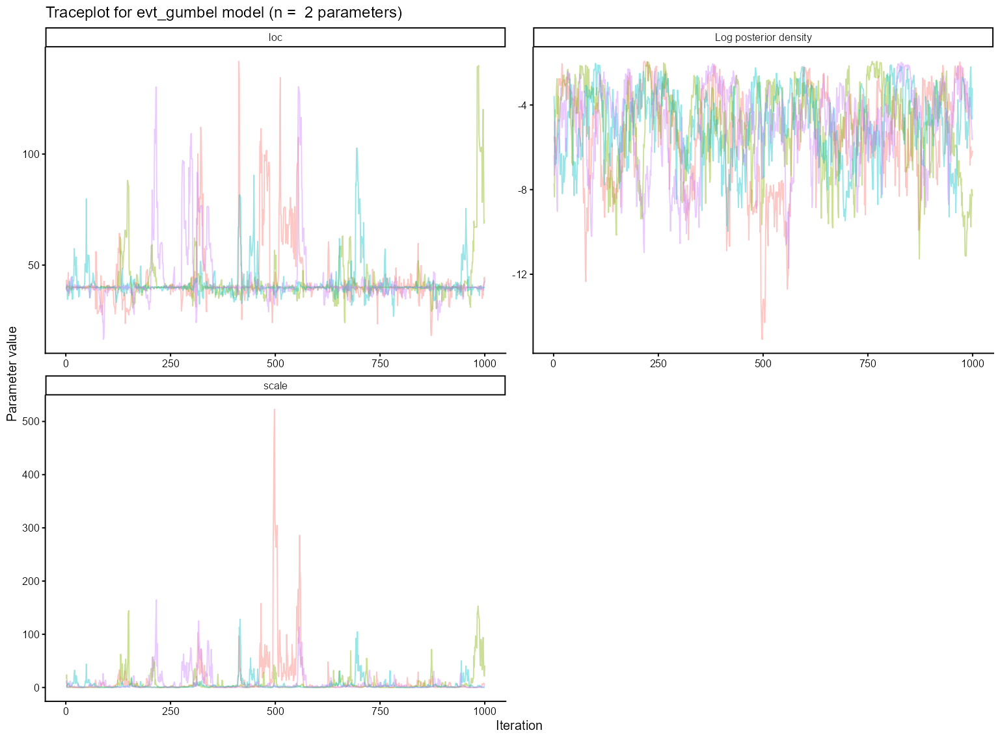
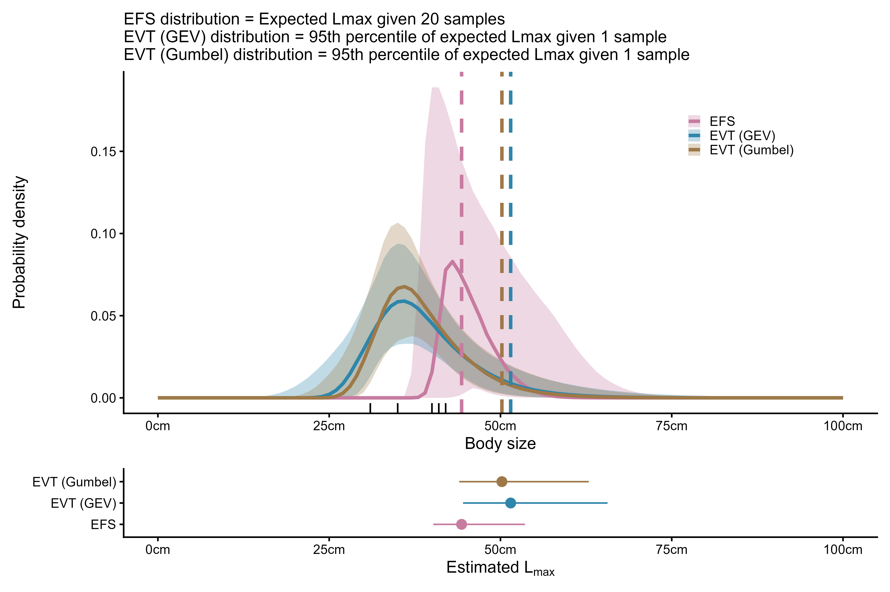
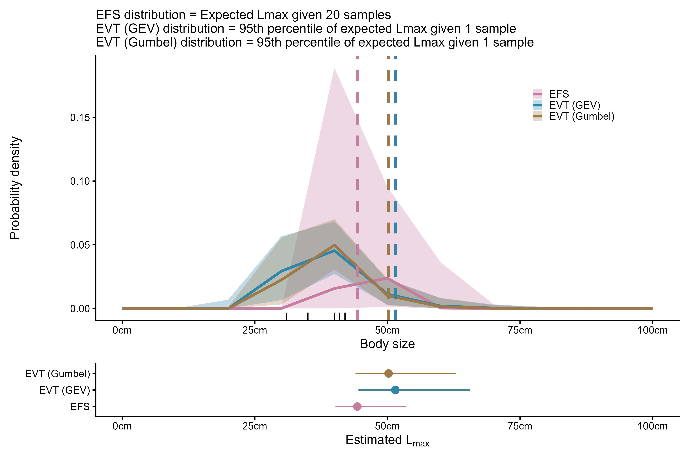

```{r, include = FALSE, message=FALSE }
knitr::opts_chunk$set(
  eval = FALSE,
  collapse = TRUE,
  comment = "#>",
  out.width = "100%"
)
```


# fishmax 

The goal of fishmax provides a robust method to estimate the maximum body length of fishes, with uncertanty. The packages uses two approaches, the first is from Extreme Value Theory (EVT), which shows that the maxima of a set of samples follows a specific distribution - the Generalised Extreme Value (GEV) distribution. The second approach uses knowledge on the underlying body size distribution to estimate the likely parameters of the underlying distribution that would give rise to the observed sample maxima. The two approaches are implemented using a Bayesian Framework, for this you need to first install the cmdstanr R package, and then install cmdstan, which is the backend C++ toolchain that allows you to fit the bayesian models. 

## Installation of cmdstan (once per machine)
<!-- maybe split into two chunks, install cmdstanr and then fishmax -->
Use of fishmax model fitting functions requires `cmdstan` to be installed. You can install cmdstan directly from R using `cmdstanr::install_cmdstan()`. Note that if you do not have cmdstan on your machine, then it may take a few minutes to install. 

To install cmdstanr and cmdstan:

```{r install_cmdstanr}
install.packages(
  "cmdstanr",
  repos = c('https://stan-dev.r-universe.dev', getOption("repos"))
) # installs cmdstanr R package
cmdstanr::install_cmdstan() # installs cmdstan (C++ toolchain); may take several minutes
```

## Installation of fishmax (once per machine)

Then to install the fishmax package itself. 

```{r install_fishmax}
install.packages("remotes")
remotes::install_github("FreddieJH/fishmax") # installs fishmax
```

## Loading of fishmax (every instance)

Once you have installed the cmdstanr package, cmdstan software, and the fishmax package, you can load the `fishmax` package. Note this needs to be for every new R session before the functions can be used. 

```{r}
library(fishmax)
```


## Example 1 - only the sample maxima are known

Let's say you have a fishing competition, where five fishers report only their largest catch for a specific fish species. The reported lengths are 40, 41, 35, 42 and 31 cm. The total number of fish that each fisher caught (sample size) is unknown. 

The first step is to fit the lmax estimation models. There are three models, that each have their own assumptions:

  1. Extreme Value Theory (using GEV distribution) - EVT (GEV)
  2. Extreme Value Theory (using Gumbel distribution) - EVT (Gumbel)
  3. Exact Finite Sample approach - EFS

The choice of which of these models you wish to use, depends on the assumptions you wish to make about the shape of the underlying body size distribution. 

  1. EVT (GEV) - fewest assumptions, any assymptotic distribution
  2. EVT (Gumbel) - assumes exponential-type (e.g., normal, positive-normal, exponential, lognormal) 
  3. EFS - assumes a positive-normal distribution and where sample size of each sample is derived from a poisson distribution

### 1. Model Fitting

```{r}

length_maxima <- c(40, 41, 35, 42, 31) #cm

# Fitting the model - by default fits all three models
model_fit <- fit_max_model(length_maxima)

```


### 2. Model Diagnostics

When checking to see if a model has converged, the first thing to do is look at the Rhat values of the parameters in the summary by printing the fitted model to the console (e.g., `model_fit`), Rhat should be less than 1.1 in early workflows, and can only really be trusted if less than 1.01. 

To check whether the models have converged, we inspect the MCMC traceplots. These show whether the chains mix well and explore the posterior without drift. See below for examples of good and bad model convergence. 

For more information about how to identify and deal with Stan model convergence issues see https://mc-stan.org/learn-stan/diagnostics-warnings.html . 


```{r traceplot}

model_fit # check out the rhat values
plot_traceplot(model_fit) # check out traceplots
```

Example of a good-mixing in MCMC traceplot:
```{r goodtraceplot, eval = TRUE, echo = FALSE}

```

Example of potenital issues in MCMC traceplot, notice how chains are struggling to converge on a parameter value:
```{r badtracplot, eval = TRUE, echo = FALSE}

```

If you observe chains that are struggling to converge for a parameter then it is worth trying to increase the number of iterations of the model. 


### 3. Model Predictions (Estimate $L_{max}$)

```{r getlmax}
# default credible interval = 80%
# default Lmax estimation is the 20-sample Lmax (k = 20) - Recommended
get_lmax(model_fit)
```

```{r eval = TRUE, echo = FALSE}
knitr::kable(read.csv("man/tables/lmax_example_table.csv"), format = "html")
```


### 4. Visualisation

```{r plotlmax}
# default credible interval = 80%
# default Lmax estimation is the 20-sample Lmax (k = 20) - Recommended
# x-axis range default is 0 to 100, but can be changed using the xmin and xmax arguments
plot_lmax(model_fit, xmax = 100)
```

```{r eval = TRUE, echo = FALSE}

```

You can also change the resolution in your x-axis, for example if you want a quick-and-dirty plot you can reduce the resolution of the x-axis (oincrease `steps` argument):

```{r visualisation-changek}

plot_lmax(model_fit, xmax = 100, xstep = 10)
```

```{r eval = TRUE, echo = FALSE}

```


## Example 2 - more information is known per sample

Let's say you have another fishing competition, there are also five fishers, but this time some of them report not only their largest catch for a specific fish species, but also the second, or third largest. The first fisher might report their two largest fish (40 and 39 cm), the second fisher their largest fish (41cm), the third fisher might report their three largest fish (33, 34 and 35 cm), etc. Once again, the total number of fish that each fisher caught (sample size) is unknown. 

The same three models (EVT (GEV), EVT (Gumbel) and EFS) are fitted. However this time, the EFS method can utilise the extra available information (the second or third largest individuals in a sample). Note that the two EVT methods cannot utilise the multiple maxima, so only the maximum of each sample is used (the result should be the same as in the original example). 

The code to fit, diagnose, predict and plot Lmax is the same. 

```{r}
# a list of vectors (of varying length)
# each element of the list represents a single fisher (five fishers)
length_maxima_multiple <- list(c(40, 39), 41, c(33, 34, 35), c(42, 40, 39), 31)


model_fit_multiple <- fit_max_model(length_maxima_multiple) # model fitting
plot_traceplot(model_fit_multiple) # check model diagnostics
get_lmax(model_fit_multiple) # output Lmax estimates
plot_lmax(model_fit_multiple) # plot the lmax estimates

```

## Example 3 - Estimating $L_{max}$ for multiple species 

You may have a situation where you have many species, and you wish to estimate $L_{max}$ for each of them. Below is one method to achieve this.  

```{r mutiplespecies}

spp_maxima_list <-
  list(
    spp1_maxima = c(40, 41, 35, 42, 31),
    spp2_maxima = c(15, 23, 28, 25),
    spp3_maxima = c(40, 41, 39, 26, 43, 48, 50),
    spp4_maxima = c(12, 15, 14)
  )
spp_maxima_list_fits <- lapply(X = spp_maxima_list, FUN = fit_max_model)
spp_maxima_list_lmax <- lapply(
  X = spp_maxima_list_fits,
  FUN = get_lmax,
  ci = 0.8,
  k = 20
)

```