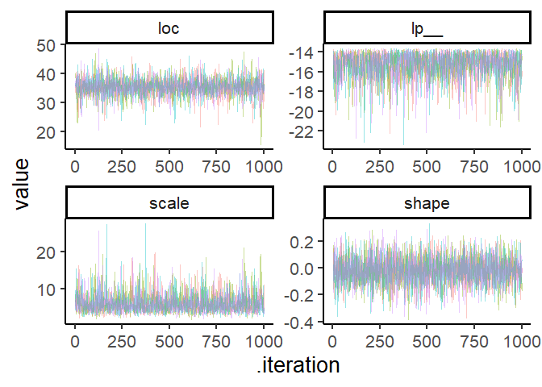

# fishmax

<!-- badges: start -->

<!-- badges: end -->

The goal of fishmax provides a robust method to estimate the maximum
body length of fishes, with uncertanty. The packages uses two
approaches, the first is from Extreme Value Theory (EVT), which shows
that the maxima of a set of samples follows a specific distribution -
the Generalised Extreme Value (GEV) distribution. The second approach
uses knowledge on the underlying body size distribution to estimate the
likely parameters of the underlying distribution that would give rise to
the observed sample maxima. The two approaches are implemented using a
Bayesian Framework.

## Installation

You can install the development version of fishmax from
[GitHub](https://github.com/) with:

``` r
# install.packages("pak")
pak::pak("FreddieJH/fishmax")
#> ℹ Loading metadata database✔ Loading metadata database ... done
#>  
#> ℹ No downloads are needed
#> ✔ 1 pkg + 54 deps: kept 38 [27.8s]
```

## Example

This is a basic example which shows you how to fit an EVT model to a set
of maxima values:

``` r
library(fishmax)

# five example sample maxima (e.g., max from five fishing competitions)
length_maxima <- c(40, 41, 35, 42, 31) #cm

evt_fit <- fit_mod(length_maxima, model_type = "evt")
#> Running MCMC with 4 sequential chains...
#> 
#> Chain 1 Iteration:    1 / 10000 [  0%]  (Warmup) 
#> Chain 1 Iteration:  100 / 10000 [  1%]  (Warmup) 
#> Chain 1 Iteration:  200 / 10000 [  2%]  (Warmup) 
#> Chain 1 Iteration:  300 / 10000 [  3%]  (Warmup) 
#> Chain 1 Iteration:  400 / 10000 [  4%]  (Warmup) 
#> Chain 1 Iteration:  500 / 10000 [  5%]  (Warmup) 
#> Chain 1 Iteration:  600 / 10000 [  6%]  (Warmup) 
#> Chain 1 Iteration:  700 / 10000 [  7%]  (Warmup) 
#> Chain 1 Iteration:  800 / 10000 [  8%]  (Warmup) 
#> Chain 1 Iteration:  900 / 10000 [  9%]  (Warmup) 
#> Chain 1 Iteration: 1000 / 10000 [ 10%]  (Warmup) 
#> Chain 1 Iteration: 1100 / 10000 [ 11%]  (Warmup) 
#> Chain 1 Iteration: 1200 / 10000 [ 12%]  (Warmup) 
#> Chain 1 Iteration: 1300 / 10000 [ 13%]  (Warmup) 
#> Chain 1 Iteration: 1400 / 10000 [ 14%]  (Warmup) 
#> Chain 1 Iteration: 1500 / 10000 [ 15%]  (Warmup) 
#> Chain 1 Iteration: 1600 / 10000 [ 16%]  (Warmup) 
#> Chain 1 Iteration: 1700 / 10000 [ 17%]  (Warmup) 
#> Chain 1 Iteration: 1800 / 10000 [ 18%]  (Warmup) 
#> Chain 1 Iteration: 1900 / 10000 [ 19%]  (Warmup) 
#> Chain 1 Iteration: 2000 / 10000 [ 20%]  (Warmup) 
#> Chain 1 Iteration: 2100 / 10000 [ 21%]  (Warmup) 
#> Chain 1 Iteration: 2200 / 10000 [ 22%]  (Warmup) 
#> Chain 1 Iteration: 2300 / 10000 [ 23%]  (Warmup) 
#> Chain 1 Iteration: 2400 / 10000 [ 24%]  (Warmup) 
#> Chain 1 Iteration: 2500 / 10000 [ 25%]  (Warmup) 
#> Chain 1 Iteration: 2600 / 10000 [ 26%]  (Warmup) 
#> Chain 1 Iteration: 2700 / 10000 [ 27%]  (Warmup) 
#> Chain 1 Iteration: 2800 / 10000 [ 28%]  (Warmup) 
#> Chain 1 Iteration: 2900 / 10000 [ 29%]  (Warmup) 
#> Chain 1 Iteration: 3000 / 10000 [ 30%]  (Warmup) 
#> Chain 1 Iteration: 3100 / 10000 [ 31%]  (Warmup) 
#> Chain 1 Iteration: 3200 / 10000 [ 32%]  (Warmup) 
#> Chain 1 Iteration: 3300 / 10000 [ 33%]  (Warmup) 
#> Chain 1 Iteration: 3400 / 10000 [ 34%]  (Warmup) 
#> Chain 1 Iteration: 3500 / 10000 [ 35%]  (Warmup) 
#> Chain 1 Iteration: 3600 / 10000 [ 36%]  (Warmup) 
#> Chain 1 Iteration: 3700 / 10000 [ 37%]  (Warmup) 
#> Chain 1 Iteration: 3800 / 10000 [ 38%]  (Warmup) 
#> Chain 1 Iteration: 3900 / 10000 [ 39%]  (Warmup) 
#> Chain 1 Iteration: 4000 / 10000 [ 40%]  (Warmup) 
#> Chain 1 Iteration: 4100 / 10000 [ 41%]  (Warmup) 
#> Chain 1 Iteration: 4200 / 10000 [ 42%]  (Warmup) 
#> Chain 1 Iteration: 4300 / 10000 [ 43%]  (Warmup) 
#> Chain 1 Iteration: 4400 / 10000 [ 44%]  (Warmup) 
#> Chain 1 Iteration: 4500 / 10000 [ 45%]  (Warmup) 
#> Chain 1 Iteration: 4600 / 10000 [ 46%]  (Warmup) 
#> Chain 1 Iteration: 4700 / 10000 [ 47%]  (Warmup) 
#> Chain 1 Iteration: 4800 / 10000 [ 48%]  (Warmup) 
#> Chain 1 Iteration: 4900 / 10000 [ 49%]  (Warmup) 
#> Chain 1 Iteration: 5000 / 10000 [ 50%]  (Warmup) 
#> Chain 1 Iteration: 5100 / 10000 [ 51%]  (Warmup) 
#> Chain 1 Iteration: 5200 / 10000 [ 52%]  (Warmup) 
#> Chain 1 Iteration: 5300 / 10000 [ 53%]  (Warmup) 
#> Chain 1 Iteration: 5400 / 10000 [ 54%]  (Warmup) 
#> Chain 1 Iteration: 5500 / 10000 [ 55%]  (Warmup) 
#> Chain 1 Iteration: 5600 / 10000 [ 56%]  (Warmup) 
#> Chain 1 Iteration: 5700 / 10000 [ 57%]  (Warmup) 
#> Chain 1 Iteration: 5800 / 10000 [ 58%]  (Warmup) 
#> Chain 1 Iteration: 5900 / 10000 [ 59%]  (Warmup) 
#> Chain 1 Iteration: 6000 / 10000 [ 60%]  (Warmup) 
#> Chain 1 Iteration: 6100 / 10000 [ 61%]  (Warmup) 
#> Chain 1 Iteration: 6200 / 10000 [ 62%]  (Warmup) 
#> Chain 1 Iteration: 6300 / 10000 [ 63%]  (Warmup) 
#> Chain 1 Iteration: 6400 / 10000 [ 64%]  (Warmup) 
#> Chain 1 Iteration: 6500 / 10000 [ 65%]  (Warmup) 
#> Chain 1 Iteration: 6600 / 10000 [ 66%]  (Warmup) 
#> Chain 1 Iteration: 6700 / 10000 [ 67%]  (Warmup) 
#> Chain 1 Iteration: 6800 / 10000 [ 68%]  (Warmup) 
#> Chain 1 Iteration: 6900 / 10000 [ 69%]  (Warmup) 
#> Chain 1 Iteration: 7000 / 10000 [ 70%]  (Warmup) 
#> Chain 1 Iteration: 7100 / 10000 [ 71%]  (Warmup) 
#> Chain 1 Iteration: 7200 / 10000 [ 72%]  (Warmup) 
#> Chain 1 Iteration: 7300 / 10000 [ 73%]  (Warmup) 
#> Chain 1 Iteration: 7400 / 10000 [ 74%]  (Warmup) 
#> Chain 1 Iteration: 7500 / 10000 [ 75%]  (Warmup) 
#> Chain 1 Iteration: 7600 / 10000 [ 76%]  (Warmup) 
#> Chain 1 Iteration: 7700 / 10000 [ 77%]  (Warmup) 
#> Chain 1 Iteration: 7800 / 10000 [ 78%]  (Warmup) 
#> Chain 1 Iteration: 7900 / 10000 [ 79%]  (Warmup) 
#> Chain 1 Iteration: 8000 / 10000 [ 80%]  (Warmup) 
#> Chain 1 Iteration: 8100 / 10000 [ 81%]  (Warmup) 
#> Chain 1 Iteration: 8200 / 10000 [ 82%]  (Warmup) 
#> Chain 1 Iteration: 8300 / 10000 [ 83%]  (Warmup) 
#> Chain 1 Iteration: 8400 / 10000 [ 84%]  (Warmup) 
#> Chain 1 Iteration: 8500 / 10000 [ 85%]  (Warmup) 
#> Chain 1 Iteration: 8600 / 10000 [ 86%]  (Warmup) 
#> Chain 1 Iteration: 8700 / 10000 [ 87%]  (Warmup) 
#> Chain 1 Iteration: 8800 / 10000 [ 88%]  (Warmup) 
#> Chain 1 Iteration: 8900 / 10000 [ 89%]  (Warmup) 
#> Chain 1 Iteration: 9000 / 10000 [ 90%]  (Warmup) 
#> Chain 1 Iteration: 9001 / 10000 [ 90%]  (Sampling) 
#> Chain 1 Iteration: 9100 / 10000 [ 91%]  (Sampling) 
#> Chain 1 Iteration: 9200 / 10000 [ 92%]  (Sampling) 
#> Chain 1 Iteration: 9300 / 10000 [ 93%]  (Sampling) 
#> Chain 1 Iteration: 9400 / 10000 [ 94%]  (Sampling) 
#> Chain 1 Iteration: 9500 / 10000 [ 95%]  (Sampling) 
#> Chain 1 Iteration: 9600 / 10000 [ 96%]  (Sampling) 
#> Chain 1 Iteration: 9700 / 10000 [ 97%]  (Sampling) 
#> Chain 1 Iteration: 9800 / 10000 [ 98%]  (Sampling) 
#> Chain 1 Iteration: 9900 / 10000 [ 99%]  (Sampling) 
#> Chain 1 Iteration: 10000 / 10000 [100%]  (Sampling) 
#> Chain 1 finished in 0.3 seconds.
#> Chain 2 Iteration:    1 / 10000 [  0%]  (Warmup) 
#> Chain 2 Iteration:  100 / 10000 [  1%]  (Warmup) 
#> Chain 2 Iteration:  200 / 10000 [  2%]  (Warmup) 
#> Chain 2 Iteration:  300 / 10000 [  3%]  (Warmup) 
#> Chain 2 Iteration:  400 / 10000 [  4%]  (Warmup) 
#> Chain 2 Iteration:  500 / 10000 [  5%]  (Warmup) 
#> Chain 2 Iteration:  600 / 10000 [  6%]  (Warmup) 
#> Chain 2 Iteration:  700 / 10000 [  7%]  (Warmup) 
#> Chain 2 Iteration:  800 / 10000 [  8%]  (Warmup) 
#> Chain 2 Iteration:  900 / 10000 [  9%]  (Warmup) 
#> Chain 2 Iteration: 1000 / 10000 [ 10%]  (Warmup) 
#> Chain 2 Iteration: 1100 / 10000 [ 11%]  (Warmup) 
#> Chain 2 Iteration: 1200 / 10000 [ 12%]  (Warmup) 
#> Chain 2 Iteration: 1300 / 10000 [ 13%]  (Warmup) 
#> Chain 2 Iteration: 1400 / 10000 [ 14%]  (Warmup) 
#> Chain 2 Iteration: 1500 / 10000 [ 15%]  (Warmup) 
#> Chain 2 Iteration: 1600 / 10000 [ 16%]  (Warmup) 
#> Chain 2 Iteration: 1700 / 10000 [ 17%]  (Warmup) 
#> Chain 2 Iteration: 1800 / 10000 [ 18%]  (Warmup) 
#> Chain 2 Iteration: 1900 / 10000 [ 19%]  (Warmup) 
#> Chain 2 Iteration: 2000 / 10000 [ 20%]  (Warmup) 
#> Chain 2 Iteration: 2100 / 10000 [ 21%]  (Warmup) 
#> Chain 2 Iteration: 2200 / 10000 [ 22%]  (Warmup) 
#> Chain 2 Iteration: 2300 / 10000 [ 23%]  (Warmup) 
#> Chain 2 Iteration: 2400 / 10000 [ 24%]  (Warmup) 
#> Chain 2 Iteration: 2500 / 10000 [ 25%]  (Warmup) 
#> Chain 2 Iteration: 2600 / 10000 [ 26%]  (Warmup) 
#> Chain 2 Iteration: 2700 / 10000 [ 27%]  (Warmup) 
#> Chain 2 Iteration: 2800 / 10000 [ 28%]  (Warmup) 
#> Chain 2 Iteration: 2900 / 10000 [ 29%]  (Warmup) 
#> Chain 2 Iteration: 3000 / 10000 [ 30%]  (Warmup) 
#> Chain 2 Iteration: 3100 / 10000 [ 31%]  (Warmup) 
#> Chain 2 Iteration: 3200 / 10000 [ 32%]  (Warmup) 
#> Chain 2 Iteration: 3300 / 10000 [ 33%]  (Warmup) 
#> Chain 2 Iteration: 3400 / 10000 [ 34%]  (Warmup) 
#> Chain 2 Iteration: 3500 / 10000 [ 35%]  (Warmup) 
#> Chain 2 Iteration: 3600 / 10000 [ 36%]  (Warmup) 
#> Chain 2 Iteration: 3700 / 10000 [ 37%]  (Warmup) 
#> Chain 2 Iteration: 3800 / 10000 [ 38%]  (Warmup) 
#> Chain 2 Iteration: 3900 / 10000 [ 39%]  (Warmup) 
#> Chain 2 Iteration: 4000 / 10000 [ 40%]  (Warmup) 
#> Chain 2 Iteration: 4100 / 10000 [ 41%]  (Warmup) 
#> Chain 2 Iteration: 4200 / 10000 [ 42%]  (Warmup) 
#> Chain 2 Iteration: 4300 / 10000 [ 43%]  (Warmup) 
#> Chain 2 Iteration: 4400 / 10000 [ 44%]  (Warmup) 
#> Chain 2 Iteration: 4500 / 10000 [ 45%]  (Warmup) 
#> Chain 2 Iteration: 4600 / 10000 [ 46%]  (Warmup) 
#> Chain 2 Iteration: 4700 / 10000 [ 47%]  (Warmup) 
#> Chain 2 Iteration: 4800 / 10000 [ 48%]  (Warmup) 
#> Chain 2 Iteration: 4900 / 10000 [ 49%]  (Warmup) 
#> Chain 2 Iteration: 5000 / 10000 [ 50%]  (Warmup) 
#> Chain 2 Iteration: 5100 / 10000 [ 51%]  (Warmup) 
#> Chain 2 Iteration: 5200 / 10000 [ 52%]  (Warmup) 
#> Chain 2 Iteration: 5300 / 10000 [ 53%]  (Warmup) 
#> Chain 2 Iteration: 5400 / 10000 [ 54%]  (Warmup) 
#> Chain 2 Iteration: 5500 / 10000 [ 55%]  (Warmup) 
#> Chain 2 Iteration: 5600 / 10000 [ 56%]  (Warmup) 
#> Chain 2 Iteration: 5700 / 10000 [ 57%]  (Warmup) 
#> Chain 2 Iteration: 5800 / 10000 [ 58%]  (Warmup) 
#> Chain 2 Iteration: 5900 / 10000 [ 59%]  (Warmup) 
#> Chain 2 Iteration: 6000 / 10000 [ 60%]  (Warmup) 
#> Chain 2 Iteration: 6100 / 10000 [ 61%]  (Warmup) 
#> Chain 2 Iteration: 6200 / 10000 [ 62%]  (Warmup) 
#> Chain 2 Iteration: 6300 / 10000 [ 63%]  (Warmup) 
#> Chain 2 Iteration: 6400 / 10000 [ 64%]  (Warmup) 
#> Chain 2 Iteration: 6500 / 10000 [ 65%]  (Warmup) 
#> Chain 2 Iteration: 6600 / 10000 [ 66%]  (Warmup) 
#> Chain 2 Iteration: 6700 / 10000 [ 67%]  (Warmup) 
#> Chain 2 Iteration: 6800 / 10000 [ 68%]  (Warmup) 
#> Chain 2 Iteration: 6900 / 10000 [ 69%]  (Warmup) 
#> Chain 2 Iteration: 7000 / 10000 [ 70%]  (Warmup) 
#> Chain 2 Iteration: 7100 / 10000 [ 71%]  (Warmup) 
#> Chain 2 Iteration: 7200 / 10000 [ 72%]  (Warmup) 
#> Chain 2 Iteration: 7300 / 10000 [ 73%]  (Warmup) 
#> Chain 2 Iteration: 7400 / 10000 [ 74%]  (Warmup) 
#> Chain 2 Iteration: 7500 / 10000 [ 75%]  (Warmup) 
#> Chain 2 Iteration: 7600 / 10000 [ 76%]  (Warmup) 
#> Chain 2 Iteration: 7700 / 10000 [ 77%]  (Warmup) 
#> Chain 2 Iteration: 7800 / 10000 [ 78%]  (Warmup) 
#> Chain 2 Iteration: 7900 / 10000 [ 79%]  (Warmup) 
#> Chain 2 Iteration: 8000 / 10000 [ 80%]  (Warmup) 
#> Chain 2 Iteration: 8100 / 10000 [ 81%]  (Warmup) 
#> Chain 2 Iteration: 8200 / 10000 [ 82%]  (Warmup) 
#> Chain 2 Iteration: 8300 / 10000 [ 83%]  (Warmup) 
#> Chain 2 Iteration: 8400 / 10000 [ 84%]  (Warmup) 
#> Chain 2 Iteration: 8500 / 10000 [ 85%]  (Warmup) 
#> Chain 2 Iteration: 8600 / 10000 [ 86%]  (Warmup) 
#> Chain 2 Iteration: 8700 / 10000 [ 87%]  (Warmup) 
#> Chain 2 Iteration: 8800 / 10000 [ 88%]  (Warmup) 
#> Chain 2 Iteration: 8900 / 10000 [ 89%]  (Warmup) 
#> Chain 2 Iteration: 9000 / 10000 [ 90%]  (Warmup) 
#> Chain 2 Iteration: 9001 / 10000 [ 90%]  (Sampling) 
#> Chain 2 Iteration: 9100 / 10000 [ 91%]  (Sampling) 
#> Chain 2 Iteration: 9200 / 10000 [ 92%]  (Sampling) 
#> Chain 2 Iteration: 9300 / 10000 [ 93%]  (Sampling) 
#> Chain 2 Iteration: 9400 / 10000 [ 94%]  (Sampling) 
#> Chain 2 Iteration: 9500 / 10000 [ 95%]  (Sampling) 
#> Chain 2 Iteration: 9600 / 10000 [ 96%]  (Sampling) 
#> Chain 2 Iteration: 9700 / 10000 [ 97%]  (Sampling) 
#> Chain 2 Iteration: 9800 / 10000 [ 98%]  (Sampling) 
#> Chain 2 Iteration: 9900 / 10000 [ 99%]  (Sampling) 
#> Chain 2 Iteration: 10000 / 10000 [100%]  (Sampling) 
#> Chain 2 finished in 0.2 seconds.
#> Chain 3 Iteration:    1 / 10000 [  0%]  (Warmup) 
#> Chain 3 Iteration:  100 / 10000 [  1%]  (Warmup) 
#> Chain 3 Iteration:  200 / 10000 [  2%]  (Warmup) 
#> Chain 3 Iteration:  300 / 10000 [  3%]  (Warmup) 
#> Chain 3 Iteration:  400 / 10000 [  4%]  (Warmup) 
#> Chain 3 Iteration:  500 / 10000 [  5%]  (Warmup) 
#> Chain 3 Iteration:  600 / 10000 [  6%]  (Warmup) 
#> Chain 3 Iteration:  700 / 10000 [  7%]  (Warmup) 
#> Chain 3 Iteration:  800 / 10000 [  8%]  (Warmup) 
#> Chain 3 Iteration:  900 / 10000 [  9%]  (Warmup) 
#> Chain 3 Iteration: 1000 / 10000 [ 10%]  (Warmup) 
#> Chain 3 Iteration: 1100 / 10000 [ 11%]  (Warmup) 
#> Chain 3 Iteration: 1200 / 10000 [ 12%]  (Warmup) 
#> Chain 3 Iteration: 1300 / 10000 [ 13%]  (Warmup) 
#> Chain 3 Iteration: 1400 / 10000 [ 14%]  (Warmup) 
#> Chain 3 Iteration: 1500 / 10000 [ 15%]  (Warmup) 
#> Chain 3 Iteration: 1600 / 10000 [ 16%]  (Warmup) 
#> Chain 3 Iteration: 1700 / 10000 [ 17%]  (Warmup) 
#> Chain 3 Iteration: 1800 / 10000 [ 18%]  (Warmup) 
#> Chain 3 Iteration: 1900 / 10000 [ 19%]  (Warmup) 
#> Chain 3 Iteration: 2000 / 10000 [ 20%]  (Warmup) 
#> Chain 3 Iteration: 2100 / 10000 [ 21%]  (Warmup) 
#> Chain 3 Iteration: 2200 / 10000 [ 22%]  (Warmup) 
#> Chain 3 Iteration: 2300 / 10000 [ 23%]  (Warmup) 
#> Chain 3 Iteration: 2400 / 10000 [ 24%]  (Warmup) 
#> Chain 3 Iteration: 2500 / 10000 [ 25%]  (Warmup) 
#> Chain 3 Iteration: 2600 / 10000 [ 26%]  (Warmup) 
#> Chain 3 Iteration: 2700 / 10000 [ 27%]  (Warmup) 
#> Chain 3 Iteration: 2800 / 10000 [ 28%]  (Warmup) 
#> Chain 3 Iteration: 2900 / 10000 [ 29%]  (Warmup) 
#> Chain 3 Iteration: 3000 / 10000 [ 30%]  (Warmup) 
#> Chain 3 Iteration: 3100 / 10000 [ 31%]  (Warmup) 
#> Chain 3 Iteration: 3200 / 10000 [ 32%]  (Warmup) 
#> Chain 3 Iteration: 3300 / 10000 [ 33%]  (Warmup) 
#> Chain 3 Iteration: 3400 / 10000 [ 34%]  (Warmup) 
#> Chain 3 Iteration: 3500 / 10000 [ 35%]  (Warmup) 
#> Chain 3 Iteration: 3600 / 10000 [ 36%]  (Warmup) 
#> Chain 3 Iteration: 3700 / 10000 [ 37%]  (Warmup) 
#> Chain 3 Iteration: 3800 / 10000 [ 38%]  (Warmup) 
#> Chain 3 Iteration: 3900 / 10000 [ 39%]  (Warmup) 
#> Chain 3 Iteration: 4000 / 10000 [ 40%]  (Warmup) 
#> Chain 3 Iteration: 4100 / 10000 [ 41%]  (Warmup) 
#> Chain 3 Iteration: 4200 / 10000 [ 42%]  (Warmup) 
#> Chain 3 Iteration: 4300 / 10000 [ 43%]  (Warmup) 
#> Chain 3 Iteration: 4400 / 10000 [ 44%]  (Warmup) 
#> Chain 3 Iteration: 4500 / 10000 [ 45%]  (Warmup) 
#> Chain 3 Iteration: 4600 / 10000 [ 46%]  (Warmup) 
#> Chain 3 Iteration: 4700 / 10000 [ 47%]  (Warmup) 
#> Chain 3 Iteration: 4800 / 10000 [ 48%]  (Warmup) 
#> Chain 3 Iteration: 4900 / 10000 [ 49%]  (Warmup) 
#> Chain 3 Iteration: 5000 / 10000 [ 50%]  (Warmup) 
#> Chain 3 Iteration: 5100 / 10000 [ 51%]  (Warmup) 
#> Chain 3 Iteration: 5200 / 10000 [ 52%]  (Warmup) 
#> Chain 3 Iteration: 5300 / 10000 [ 53%]  (Warmup) 
#> Chain 3 Iteration: 5400 / 10000 [ 54%]  (Warmup) 
#> Chain 3 Iteration: 5500 / 10000 [ 55%]  (Warmup) 
#> Chain 3 Iteration: 5600 / 10000 [ 56%]  (Warmup) 
#> Chain 3 Iteration: 5700 / 10000 [ 57%]  (Warmup) 
#> Chain 3 Iteration: 5800 / 10000 [ 58%]  (Warmup) 
#> Chain 3 Iteration: 5900 / 10000 [ 59%]  (Warmup) 
#> Chain 3 Iteration: 6000 / 10000 [ 60%]  (Warmup) 
#> Chain 3 Iteration: 6100 / 10000 [ 61%]  (Warmup) 
#> Chain 3 Iteration: 6200 / 10000 [ 62%]  (Warmup) 
#> Chain 3 Iteration: 6300 / 10000 [ 63%]  (Warmup) 
#> Chain 3 Iteration: 6400 / 10000 [ 64%]  (Warmup) 
#> Chain 3 Iteration: 6500 / 10000 [ 65%]  (Warmup) 
#> Chain 3 Iteration: 6600 / 10000 [ 66%]  (Warmup) 
#> Chain 3 Iteration: 6700 / 10000 [ 67%]  (Warmup) 
#> Chain 3 Iteration: 6800 / 10000 [ 68%]  (Warmup) 
#> Chain 3 Iteration: 6900 / 10000 [ 69%]  (Warmup) 
#> Chain 3 Iteration: 7000 / 10000 [ 70%]  (Warmup) 
#> Chain 3 Iteration: 7100 / 10000 [ 71%]  (Warmup) 
#> Chain 3 Iteration: 7200 / 10000 [ 72%]  (Warmup) 
#> Chain 3 Iteration: 7300 / 10000 [ 73%]  (Warmup) 
#> Chain 3 Iteration: 7400 / 10000 [ 74%]  (Warmup) 
#> Chain 3 Iteration: 7500 / 10000 [ 75%]  (Warmup) 
#> Chain 3 Iteration: 7600 / 10000 [ 76%]  (Warmup) 
#> Chain 3 Iteration: 7700 / 10000 [ 77%]  (Warmup) 
#> Chain 3 Iteration: 7800 / 10000 [ 78%]  (Warmup) 
#> Chain 3 Iteration: 7900 / 10000 [ 79%]  (Warmup) 
#> Chain 3 Iteration: 8000 / 10000 [ 80%]  (Warmup) 
#> Chain 3 Iteration: 8100 / 10000 [ 81%]  (Warmup) 
#> Chain 3 Iteration: 8200 / 10000 [ 82%]  (Warmup) 
#> Chain 3 Iteration: 8300 / 10000 [ 83%]  (Warmup) 
#> Chain 3 Iteration: 8400 / 10000 [ 84%]  (Warmup) 
#> Chain 3 Iteration: 8500 / 10000 [ 85%]  (Warmup) 
#> Chain 3 Iteration: 8600 / 10000 [ 86%]  (Warmup) 
#> Chain 3 Iteration: 8700 / 10000 [ 87%]  (Warmup) 
#> Chain 3 Iteration: 8800 / 10000 [ 88%]  (Warmup) 
#> Chain 3 Iteration: 8900 / 10000 [ 89%]  (Warmup) 
#> Chain 3 Iteration: 9000 / 10000 [ 90%]  (Warmup) 
#> Chain 3 Iteration: 9001 / 10000 [ 90%]  (Sampling) 
#> Chain 3 Iteration: 9100 / 10000 [ 91%]  (Sampling) 
#> Chain 3 Iteration: 9200 / 10000 [ 92%]  (Sampling) 
#> Chain 3 Iteration: 9300 / 10000 [ 93%]  (Sampling) 
#> Chain 3 Iteration: 9400 / 10000 [ 94%]  (Sampling) 
#> Chain 3 Iteration: 9500 / 10000 [ 95%]  (Sampling) 
#> Chain 3 Iteration: 9600 / 10000 [ 96%]  (Sampling) 
#> Chain 3 Iteration: 9700 / 10000 [ 97%]  (Sampling) 
#> Chain 3 Iteration: 9800 / 10000 [ 98%]  (Sampling) 
#> Chain 3 Iteration: 9900 / 10000 [ 99%]  (Sampling) 
#> Chain 3 Iteration: 10000 / 10000 [100%]  (Sampling) 
#> Chain 3 finished in 0.2 seconds.
#> Chain 4 Iteration:    1 / 10000 [  0%]  (Warmup) 
#> Chain 4 Iteration:  100 / 10000 [  1%]  (Warmup) 
#> Chain 4 Iteration:  200 / 10000 [  2%]  (Warmup) 
#> Chain 4 Iteration:  300 / 10000 [  3%]  (Warmup) 
#> Chain 4 Iteration:  400 / 10000 [  4%]  (Warmup) 
#> Chain 4 Iteration:  500 / 10000 [  5%]  (Warmup) 
#> Chain 4 Iteration:  600 / 10000 [  6%]  (Warmup) 
#> Chain 4 Iteration:  700 / 10000 [  7%]  (Warmup) 
#> Chain 4 Iteration:  800 / 10000 [  8%]  (Warmup) 
#> Chain 4 Iteration:  900 / 10000 [  9%]  (Warmup) 
#> Chain 4 Iteration: 1000 / 10000 [ 10%]  (Warmup) 
#> Chain 4 Iteration: 1100 / 10000 [ 11%]  (Warmup) 
#> Chain 4 Iteration: 1200 / 10000 [ 12%]  (Warmup) 
#> Chain 4 Iteration: 1300 / 10000 [ 13%]  (Warmup) 
#> Chain 4 Iteration: 1400 / 10000 [ 14%]  (Warmup) 
#> Chain 4 Iteration: 1500 / 10000 [ 15%]  (Warmup) 
#> Chain 4 Iteration: 1600 / 10000 [ 16%]  (Warmup) 
#> Chain 4 Iteration: 1700 / 10000 [ 17%]  (Warmup) 
#> Chain 4 Iteration: 1800 / 10000 [ 18%]  (Warmup) 
#> Chain 4 Iteration: 1900 / 10000 [ 19%]  (Warmup) 
#> Chain 4 Iteration: 2000 / 10000 [ 20%]  (Warmup) 
#> Chain 4 Iteration: 2100 / 10000 [ 21%]  (Warmup) 
#> Chain 4 Iteration: 2200 / 10000 [ 22%]  (Warmup) 
#> Chain 4 Iteration: 2300 / 10000 [ 23%]  (Warmup) 
#> Chain 4 Iteration: 2400 / 10000 [ 24%]  (Warmup) 
#> Chain 4 Iteration: 2500 / 10000 [ 25%]  (Warmup) 
#> Chain 4 Iteration: 2600 / 10000 [ 26%]  (Warmup) 
#> Chain 4 Iteration: 2700 / 10000 [ 27%]  (Warmup) 
#> Chain 4 Iteration: 2800 / 10000 [ 28%]  (Warmup) 
#> Chain 4 Iteration: 2900 / 10000 [ 29%]  (Warmup) 
#> Chain 4 Iteration: 3000 / 10000 [ 30%]  (Warmup) 
#> Chain 4 Iteration: 3100 / 10000 [ 31%]  (Warmup) 
#> Chain 4 Iteration: 3200 / 10000 [ 32%]  (Warmup) 
#> Chain 4 Iteration: 3300 / 10000 [ 33%]  (Warmup) 
#> Chain 4 Iteration: 3400 / 10000 [ 34%]  (Warmup) 
#> Chain 4 Iteration: 3500 / 10000 [ 35%]  (Warmup) 
#> Chain 4 Iteration: 3600 / 10000 [ 36%]  (Warmup) 
#> Chain 4 Iteration: 3700 / 10000 [ 37%]  (Warmup) 
#> Chain 4 Iteration: 3800 / 10000 [ 38%]  (Warmup) 
#> Chain 4 Iteration: 3900 / 10000 [ 39%]  (Warmup) 
#> Chain 4 Iteration: 4000 / 10000 [ 40%]  (Warmup) 
#> Chain 4 Iteration: 4100 / 10000 [ 41%]  (Warmup) 
#> Chain 4 Iteration: 4200 / 10000 [ 42%]  (Warmup) 
#> Chain 4 Iteration: 4300 / 10000 [ 43%]  (Warmup) 
#> Chain 4 Iteration: 4400 / 10000 [ 44%]  (Warmup) 
#> Chain 4 Iteration: 4500 / 10000 [ 45%]  (Warmup) 
#> Chain 4 Iteration: 4600 / 10000 [ 46%]  (Warmup) 
#> Chain 4 Iteration: 4700 / 10000 [ 47%]  (Warmup) 
#> Chain 4 Iteration: 4800 / 10000 [ 48%]  (Warmup) 
#> Chain 4 Iteration: 4900 / 10000 [ 49%]  (Warmup) 
#> Chain 4 Iteration: 5000 / 10000 [ 50%]  (Warmup) 
#> Chain 4 Iteration: 5100 / 10000 [ 51%]  (Warmup) 
#> Chain 4 Iteration: 5200 / 10000 [ 52%]  (Warmup) 
#> Chain 4 Iteration: 5300 / 10000 [ 53%]  (Warmup) 
#> Chain 4 Iteration: 5400 / 10000 [ 54%]  (Warmup) 
#> Chain 4 Iteration: 5500 / 10000 [ 55%]  (Warmup) 
#> Chain 4 Iteration: 5600 / 10000 [ 56%]  (Warmup) 
#> Chain 4 Iteration: 5700 / 10000 [ 57%]  (Warmup) 
#> Chain 4 Iteration: 5800 / 10000 [ 58%]  (Warmup) 
#> Chain 4 Iteration: 5900 / 10000 [ 59%]  (Warmup) 
#> Chain 4 Iteration: 6000 / 10000 [ 60%]  (Warmup) 
#> Chain 4 Iteration: 6100 / 10000 [ 61%]  (Warmup) 
#> Chain 4 Iteration: 6200 / 10000 [ 62%]  (Warmup) 
#> Chain 4 Iteration: 6300 / 10000 [ 63%]  (Warmup) 
#> Chain 4 Iteration: 6400 / 10000 [ 64%]  (Warmup) 
#> Chain 4 Iteration: 6500 / 10000 [ 65%]  (Warmup) 
#> Chain 4 Iteration: 6600 / 10000 [ 66%]  (Warmup) 
#> Chain 4 Iteration: 6700 / 10000 [ 67%]  (Warmup) 
#> Chain 4 Iteration: 6800 / 10000 [ 68%]  (Warmup) 
#> Chain 4 Iteration: 6900 / 10000 [ 69%]  (Warmup) 
#> Chain 4 Iteration: 7000 / 10000 [ 70%]  (Warmup) 
#> Chain 4 Iteration: 7100 / 10000 [ 71%]  (Warmup) 
#> Chain 4 Iteration: 7200 / 10000 [ 72%]  (Warmup) 
#> Chain 4 Iteration: 7300 / 10000 [ 73%]  (Warmup) 
#> Chain 4 Iteration: 7400 / 10000 [ 74%]  (Warmup) 
#> Chain 4 Iteration: 7500 / 10000 [ 75%]  (Warmup) 
#> Chain 4 Iteration: 7600 / 10000 [ 76%]  (Warmup) 
#> Chain 4 Iteration: 7700 / 10000 [ 77%]  (Warmup) 
#> Chain 4 Iteration: 7800 / 10000 [ 78%]  (Warmup) 
#> Chain 4 Iteration: 7900 / 10000 [ 79%]  (Warmup) 
#> Chain 4 Iteration: 8000 / 10000 [ 80%]  (Warmup) 
#> Chain 4 Iteration: 8100 / 10000 [ 81%]  (Warmup) 
#> Chain 4 Iteration: 8200 / 10000 [ 82%]  (Warmup) 
#> Chain 4 Iteration: 8300 / 10000 [ 83%]  (Warmup) 
#> Chain 4 Iteration: 8400 / 10000 [ 84%]  (Warmup) 
#> Chain 4 Iteration: 8500 / 10000 [ 85%]  (Warmup) 
#> Chain 4 Iteration: 8600 / 10000 [ 86%]  (Warmup) 
#> Chain 4 Iteration: 8700 / 10000 [ 87%]  (Warmup) 
#> Chain 4 Iteration: 8800 / 10000 [ 88%]  (Warmup) 
#> Chain 4 Iteration: 8900 / 10000 [ 89%]  (Warmup) 
#> Chain 4 Iteration: 9000 / 10000 [ 90%]  (Warmup) 
#> Chain 4 Iteration: 9001 / 10000 [ 90%]  (Sampling) 
#> Chain 4 Iteration: 9100 / 10000 [ 91%]  (Sampling) 
#> Chain 4 Iteration: 9200 / 10000 [ 92%]  (Sampling) 
#> Chain 4 Iteration: 9300 / 10000 [ 93%]  (Sampling) 
#> Chain 4 Iteration: 9400 / 10000 [ 94%]  (Sampling) 
#> Chain 4 Iteration: 9500 / 10000 [ 95%]  (Sampling) 
#> Chain 4 Iteration: 9600 / 10000 [ 96%]  (Sampling) 
#> Chain 4 Iteration: 9700 / 10000 [ 97%]  (Sampling) 
#> Chain 4 Iteration: 9800 / 10000 [ 98%]  (Sampling) 
#> Chain 4 Iteration: 9900 / 10000 [ 99%]  (Sampling) 
#> Chain 4 Iteration: 10000 / 10000 [100%]  (Sampling) 
#> Chain 4 finished in 0.3 seconds.
#> 
#> All 4 chains finished successfully.
#> Mean chain execution time: 0.3 seconds.
#> Total execution time: 2.2 seconds.
#> Warning: 6 of 4000 (0.0%) transitions ended with a divergence.
#> See https://mc-stan.org/misc/warnings for details.
efs_fit <- fit_mod(length_maxima, model_type = "efs")
#> Running MCMC with 4 sequential chains...
#> 
#> Chain 1 Iteration:    1 / 10000 [  0%]  (Warmup) 
#> Chain 1 Iteration:  100 / 10000 [  1%]  (Warmup) 
#> Chain 1 Iteration:  200 / 10000 [  2%]  (Warmup) 
#> Chain 1 Iteration:  300 / 10000 [  3%]  (Warmup) 
#> Chain 1 Iteration:  400 / 10000 [  4%]  (Warmup) 
#> Chain 1 Iteration:  500 / 10000 [  5%]  (Warmup) 
#> Chain 1 Iteration:  600 / 10000 [  6%]  (Warmup) 
#> Chain 1 Iteration:  700 / 10000 [  7%]  (Warmup) 
#> Chain 1 Iteration:  800 / 10000 [  8%]  (Warmup) 
#> Chain 1 Iteration:  900 / 10000 [  9%]  (Warmup) 
#> Chain 1 Iteration: 1000 / 10000 [ 10%]  (Warmup) 
#> Chain 1 Iteration: 1100 / 10000 [ 11%]  (Warmup) 
#> Chain 1 Iteration: 1200 / 10000 [ 12%]  (Warmup) 
#> Chain 1 Iteration: 1300 / 10000 [ 13%]  (Warmup) 
#> Chain 1 Iteration: 1400 / 10000 [ 14%]  (Warmup) 
#> Chain 1 Iteration: 1500 / 10000 [ 15%]  (Warmup) 
#> Chain 1 Iteration: 1600 / 10000 [ 16%]  (Warmup) 
#> Chain 1 Iteration: 1700 / 10000 [ 17%]  (Warmup) 
#> Chain 1 Iteration: 1800 / 10000 [ 18%]  (Warmup) 
#> Chain 1 Iteration: 1900 / 10000 [ 19%]  (Warmup) 
#> Chain 1 Iteration: 2000 / 10000 [ 20%]  (Warmup) 
#> Chain 1 Iteration: 2100 / 10000 [ 21%]  (Warmup) 
#> Chain 1 Iteration: 2200 / 10000 [ 22%]  (Warmup) 
#> Chain 1 Iteration: 2300 / 10000 [ 23%]  (Warmup) 
#> Chain 1 Iteration: 2400 / 10000 [ 24%]  (Warmup) 
#> Chain 1 Iteration: 2500 / 10000 [ 25%]  (Warmup) 
#> Chain 1 Iteration: 2600 / 10000 [ 26%]  (Warmup) 
#> Chain 1 Iteration: 2700 / 10000 [ 27%]  (Warmup) 
#> Chain 1 Iteration: 2800 / 10000 [ 28%]  (Warmup) 
#> Chain 1 Iteration: 2900 / 10000 [ 29%]  (Warmup) 
#> Chain 1 Iteration: 3000 / 10000 [ 30%]  (Warmup) 
#> Chain 1 Iteration: 3100 / 10000 [ 31%]  (Warmup) 
#> Chain 1 Iteration: 3200 / 10000 [ 32%]  (Warmup) 
#> Chain 1 Iteration: 3300 / 10000 [ 33%]  (Warmup) 
#> Chain 1 Iteration: 3400 / 10000 [ 34%]  (Warmup) 
#> Chain 1 Iteration: 3500 / 10000 [ 35%]  (Warmup) 
#> Chain 1 Iteration: 3600 / 10000 [ 36%]  (Warmup) 
#> Chain 1 Iteration: 3700 / 10000 [ 37%]  (Warmup) 
#> Chain 1 Iteration: 3800 / 10000 [ 38%]  (Warmup) 
#> Chain 1 Iteration: 3900 / 10000 [ 39%]  (Warmup) 
#> Chain 1 Iteration: 4000 / 10000 [ 40%]  (Warmup) 
#> Chain 1 Iteration: 4100 / 10000 [ 41%]  (Warmup) 
#> Chain 1 Iteration: 4200 / 10000 [ 42%]  (Warmup) 
#> Chain 1 Iteration: 4300 / 10000 [ 43%]  (Warmup) 
#> Chain 1 Iteration: 4400 / 10000 [ 44%]  (Warmup) 
#> Chain 1 Iteration: 4500 / 10000 [ 45%]  (Warmup) 
#> Chain 1 Iteration: 4600 / 10000 [ 46%]  (Warmup) 
#> Chain 1 Iteration: 4700 / 10000 [ 47%]  (Warmup) 
#> Chain 1 Iteration: 4800 / 10000 [ 48%]  (Warmup) 
#> Chain 1 Iteration: 4900 / 10000 [ 49%]  (Warmup) 
#> Chain 1 Iteration: 5000 / 10000 [ 50%]  (Warmup) 
#> Chain 1 Iteration: 5100 / 10000 [ 51%]  (Warmup) 
#> Chain 1 Iteration: 5200 / 10000 [ 52%]  (Warmup) 
#> Chain 1 Iteration: 5300 / 10000 [ 53%]  (Warmup) 
#> Chain 1 Iteration: 5400 / 10000 [ 54%]  (Warmup) 
#> Chain 1 Iteration: 5500 / 10000 [ 55%]  (Warmup) 
#> Chain 1 Iteration: 5600 / 10000 [ 56%]  (Warmup) 
#> Chain 1 Iteration: 5700 / 10000 [ 57%]  (Warmup) 
#> Chain 1 Iteration: 5800 / 10000 [ 58%]  (Warmup) 
#> Chain 1 Iteration: 5900 / 10000 [ 59%]  (Warmup) 
#> Chain 1 Iteration: 6000 / 10000 [ 60%]  (Warmup) 
#> Chain 1 Iteration: 6100 / 10000 [ 61%]  (Warmup) 
#> Chain 1 Iteration: 6200 / 10000 [ 62%]  (Warmup) 
#> Chain 1 Iteration: 6300 / 10000 [ 63%]  (Warmup) 
#> Chain 1 Iteration: 6400 / 10000 [ 64%]  (Warmup) 
#> Chain 1 Iteration: 6500 / 10000 [ 65%]  (Warmup) 
#> Chain 1 Iteration: 6600 / 10000 [ 66%]  (Warmup) 
#> Chain 1 Iteration: 6700 / 10000 [ 67%]  (Warmup) 
#> Chain 1 Iteration: 6800 / 10000 [ 68%]  (Warmup) 
#> Chain 1 Iteration: 6900 / 10000 [ 69%]  (Warmup) 
#> Chain 1 Iteration: 7000 / 10000 [ 70%]  (Warmup) 
#> Chain 1 Iteration: 7100 / 10000 [ 71%]  (Warmup) 
#> Chain 1 Iteration: 7200 / 10000 [ 72%]  (Warmup) 
#> Chain 1 Iteration: 7300 / 10000 [ 73%]  (Warmup) 
#> Chain 1 Iteration: 7400 / 10000 [ 74%]  (Warmup) 
#> Chain 1 Iteration: 7500 / 10000 [ 75%]  (Warmup) 
#> Chain 1 Iteration: 7600 / 10000 [ 76%]  (Warmup) 
#> Chain 1 Iteration: 7700 / 10000 [ 77%]  (Warmup) 
#> Chain 1 Iteration: 7800 / 10000 [ 78%]  (Warmup) 
#> Chain 1 Iteration: 7900 / 10000 [ 79%]  (Warmup) 
#> Chain 1 Iteration: 8000 / 10000 [ 80%]  (Warmup) 
#> Chain 1 Iteration: 8100 / 10000 [ 81%]  (Warmup) 
#> Chain 1 Iteration: 8200 / 10000 [ 82%]  (Warmup) 
#> Chain 1 Iteration: 8300 / 10000 [ 83%]  (Warmup) 
#> Chain 1 Iteration: 8400 / 10000 [ 84%]  (Warmup) 
#> Chain 1 Iteration: 8500 / 10000 [ 85%]  (Warmup) 
#> Chain 1 Iteration: 8600 / 10000 [ 86%]  (Warmup) 
#> Chain 1 Iteration: 8700 / 10000 [ 87%]  (Warmup) 
#> Chain 1 Iteration: 8800 / 10000 [ 88%]  (Warmup) 
#> Chain 1 Iteration: 8900 / 10000 [ 89%]  (Warmup) 
#> Chain 1 Iteration: 9000 / 10000 [ 90%]  (Warmup) 
#> Chain 1 Iteration: 9001 / 10000 [ 90%]  (Sampling) 
#> Chain 1 Iteration: 9100 / 10000 [ 91%]  (Sampling) 
#> Chain 1 Iteration: 9200 / 10000 [ 92%]  (Sampling) 
#> Chain 1 Iteration: 9300 / 10000 [ 93%]  (Sampling) 
#> Chain 1 Iteration: 9400 / 10000 [ 94%]  (Sampling) 
#> Chain 1 Iteration: 9500 / 10000 [ 95%]  (Sampling) 
#> Chain 1 Iteration: 9600 / 10000 [ 96%]  (Sampling) 
#> Chain 1 Iteration: 9700 / 10000 [ 97%]  (Sampling) 
#> Chain 1 Iteration: 9800 / 10000 [ 98%]  (Sampling) 
#> Chain 1 Iteration: 9900 / 10000 [ 99%]  (Sampling) 
#> Chain 1 Iteration: 10000 / 10000 [100%]  (Sampling) 
#> Chain 1 finished in 1.1 seconds.
#> Chain 2 Iteration:    1 / 10000 [  0%]  (Warmup) 
#> Chain 2 Iteration:  100 / 10000 [  1%]  (Warmup) 
#> Chain 2 Iteration:  200 / 10000 [  2%]  (Warmup) 
#> Chain 2 Iteration:  300 / 10000 [  3%]  (Warmup) 
#> Chain 2 Iteration:  400 / 10000 [  4%]  (Warmup) 
#> Chain 2 Iteration:  500 / 10000 [  5%]  (Warmup) 
#> Chain 2 Iteration:  600 / 10000 [  6%]  (Warmup) 
#> Chain 2 Iteration:  700 / 10000 [  7%]  (Warmup) 
#> Chain 2 Iteration:  800 / 10000 [  8%]  (Warmup) 
#> Chain 2 Iteration:  900 / 10000 [  9%]  (Warmup) 
#> Chain 2 Iteration: 1000 / 10000 [ 10%]  (Warmup) 
#> Chain 2 Iteration: 1100 / 10000 [ 11%]  (Warmup) 
#> Chain 2 Iteration: 1200 / 10000 [ 12%]  (Warmup) 
#> Chain 2 Iteration: 1300 / 10000 [ 13%]  (Warmup) 
#> Chain 2 Iteration: 1400 / 10000 [ 14%]  (Warmup) 
#> Chain 2 Iteration: 1500 / 10000 [ 15%]  (Warmup) 
#> Chain 2 Iteration: 1600 / 10000 [ 16%]  (Warmup) 
#> Chain 2 Iteration: 1700 / 10000 [ 17%]  (Warmup) 
#> Chain 2 Iteration: 1800 / 10000 [ 18%]  (Warmup) 
#> Chain 2 Iteration: 1900 / 10000 [ 19%]  (Warmup) 
#> Chain 2 Iteration: 2000 / 10000 [ 20%]  (Warmup) 
#> Chain 2 Iteration: 2100 / 10000 [ 21%]  (Warmup) 
#> Chain 2 Iteration: 2200 / 10000 [ 22%]  (Warmup) 
#> Chain 2 Iteration: 2300 / 10000 [ 23%]  (Warmup) 
#> Chain 2 Iteration: 2400 / 10000 [ 24%]  (Warmup) 
#> Chain 2 Iteration: 2500 / 10000 [ 25%]  (Warmup) 
#> Chain 2 Iteration: 2600 / 10000 [ 26%]  (Warmup) 
#> Chain 2 Iteration: 2700 / 10000 [ 27%]  (Warmup) 
#> Chain 2 Iteration: 2800 / 10000 [ 28%]  (Warmup) 
#> Chain 2 Iteration: 2900 / 10000 [ 29%]  (Warmup) 
#> Chain 2 Iteration: 3000 / 10000 [ 30%]  (Warmup) 
#> Chain 2 Iteration: 3100 / 10000 [ 31%]  (Warmup) 
#> Chain 2 Iteration: 3200 / 10000 [ 32%]  (Warmup) 
#> Chain 2 Iteration: 3300 / 10000 [ 33%]  (Warmup) 
#> Chain 2 Iteration: 3400 / 10000 [ 34%]  (Warmup) 
#> Chain 2 Iteration: 3500 / 10000 [ 35%]  (Warmup) 
#> Chain 2 Iteration: 3600 / 10000 [ 36%]  (Warmup) 
#> Chain 2 Iteration: 3700 / 10000 [ 37%]  (Warmup) 
#> Chain 2 Iteration: 3800 / 10000 [ 38%]  (Warmup) 
#> Chain 2 Iteration: 3900 / 10000 [ 39%]  (Warmup) 
#> Chain 2 Iteration: 4000 / 10000 [ 40%]  (Warmup) 
#> Chain 2 Iteration: 4100 / 10000 [ 41%]  (Warmup) 
#> Chain 2 Iteration: 4200 / 10000 [ 42%]  (Warmup) 
#> Chain 2 Iteration: 4300 / 10000 [ 43%]  (Warmup) 
#> Chain 2 Iteration: 4400 / 10000 [ 44%]  (Warmup) 
#> Chain 2 Iteration: 4500 / 10000 [ 45%]  (Warmup) 
#> Chain 2 Iteration: 4600 / 10000 [ 46%]  (Warmup) 
#> Chain 2 Iteration: 4700 / 10000 [ 47%]  (Warmup) 
#> Chain 2 Iteration: 4800 / 10000 [ 48%]  (Warmup) 
#> Chain 2 Iteration: 4900 / 10000 [ 49%]  (Warmup) 
#> Chain 2 Iteration: 5000 / 10000 [ 50%]  (Warmup) 
#> Chain 2 Iteration: 5100 / 10000 [ 51%]  (Warmup) 
#> Chain 2 Iteration: 5200 / 10000 [ 52%]  (Warmup) 
#> Chain 2 Iteration: 5300 / 10000 [ 53%]  (Warmup) 
#> Chain 2 Iteration: 5400 / 10000 [ 54%]  (Warmup) 
#> Chain 2 Iteration: 5500 / 10000 [ 55%]  (Warmup) 
#> Chain 2 Iteration: 5600 / 10000 [ 56%]  (Warmup) 
#> Chain 2 Iteration: 5700 / 10000 [ 57%]  (Warmup) 
#> Chain 2 Iteration: 5800 / 10000 [ 58%]  (Warmup) 
#> Chain 2 Iteration: 5900 / 10000 [ 59%]  (Warmup) 
#> Chain 2 Iteration: 6000 / 10000 [ 60%]  (Warmup) 
#> Chain 2 Iteration: 6100 / 10000 [ 61%]  (Warmup) 
#> Chain 2 Iteration: 6200 / 10000 [ 62%]  (Warmup) 
#> Chain 2 Iteration: 6300 / 10000 [ 63%]  (Warmup) 
#> Chain 2 Iteration: 6400 / 10000 [ 64%]  (Warmup) 
#> Chain 2 Iteration: 6500 / 10000 [ 65%]  (Warmup) 
#> Chain 2 Iteration: 6600 / 10000 [ 66%]  (Warmup) 
#> Chain 2 Iteration: 6700 / 10000 [ 67%]  (Warmup) 
#> Chain 2 Iteration: 6800 / 10000 [ 68%]  (Warmup) 
#> Chain 2 Iteration: 6900 / 10000 [ 69%]  (Warmup) 
#> Chain 2 Iteration: 7000 / 10000 [ 70%]  (Warmup) 
#> Chain 2 Iteration: 7100 / 10000 [ 71%]  (Warmup) 
#> Chain 2 Iteration: 7200 / 10000 [ 72%]  (Warmup) 
#> Chain 2 Iteration: 7300 / 10000 [ 73%]  (Warmup) 
#> Chain 2 Iteration: 7400 / 10000 [ 74%]  (Warmup) 
#> Chain 2 Iteration: 7500 / 10000 [ 75%]  (Warmup) 
#> Chain 2 Iteration: 7600 / 10000 [ 76%]  (Warmup) 
#> Chain 2 Iteration: 7700 / 10000 [ 77%]  (Warmup) 
#> Chain 2 Iteration: 7800 / 10000 [ 78%]  (Warmup) 
#> Chain 2 Iteration: 7900 / 10000 [ 79%]  (Warmup) 
#> Chain 2 Iteration: 8000 / 10000 [ 80%]  (Warmup) 
#> Chain 2 Iteration: 8100 / 10000 [ 81%]  (Warmup) 
#> Chain 2 Iteration: 8200 / 10000 [ 82%]  (Warmup) 
#> Chain 2 Iteration: 8300 / 10000 [ 83%]  (Warmup) 
#> Chain 2 Iteration: 8400 / 10000 [ 84%]  (Warmup) 
#> Chain 2 Iteration: 8500 / 10000 [ 85%]  (Warmup) 
#> Chain 2 Iteration: 8600 / 10000 [ 86%]  (Warmup) 
#> Chain 2 Iteration: 8700 / 10000 [ 87%]  (Warmup) 
#> Chain 2 Iteration: 8800 / 10000 [ 88%]  (Warmup) 
#> Chain 2 Iteration: 8900 / 10000 [ 89%]  (Warmup) 
#> Chain 2 Iteration: 9000 / 10000 [ 90%]  (Warmup) 
#> Chain 2 Iteration: 9001 / 10000 [ 90%]  (Sampling) 
#> Chain 2 Iteration: 9100 / 10000 [ 91%]  (Sampling) 
#> Chain 2 Iteration: 9200 / 10000 [ 92%]  (Sampling) 
#> Chain 2 Iteration: 9300 / 10000 [ 93%]  (Sampling) 
#> Chain 2 Iteration: 9400 / 10000 [ 94%]  (Sampling) 
#> Chain 2 Iteration: 9500 / 10000 [ 95%]  (Sampling) 
#> Chain 2 Iteration: 9600 / 10000 [ 96%]  (Sampling) 
#> Chain 2 Iteration: 9700 / 10000 [ 97%]  (Sampling) 
#> Chain 2 Iteration: 9800 / 10000 [ 98%]  (Sampling) 
#> Chain 2 Iteration: 9900 / 10000 [ 99%]  (Sampling) 
#> Chain 2 Iteration: 10000 / 10000 [100%]  (Sampling) 
#> Chain 2 finished in 1.1 seconds.
#> Chain 3 Iteration:    1 / 10000 [  0%]  (Warmup) 
#> Chain 3 Iteration:  100 / 10000 [  1%]  (Warmup) 
#> Chain 3 Iteration:  200 / 10000 [  2%]  (Warmup) 
#> Chain 3 Iteration:  300 / 10000 [  3%]  (Warmup) 
#> Chain 3 Iteration:  400 / 10000 [  4%]  (Warmup) 
#> Chain 3 Iteration:  500 / 10000 [  5%]  (Warmup) 
#> Chain 3 Iteration:  600 / 10000 [  6%]  (Warmup) 
#> Chain 3 Iteration:  700 / 10000 [  7%]  (Warmup) 
#> Chain 3 Iteration:  800 / 10000 [  8%]  (Warmup) 
#> Chain 3 Iteration:  900 / 10000 [  9%]  (Warmup) 
#> Chain 3 Iteration: 1000 / 10000 [ 10%]  (Warmup) 
#> Chain 3 Iteration: 1100 / 10000 [ 11%]  (Warmup) 
#> Chain 3 Iteration: 1200 / 10000 [ 12%]  (Warmup) 
#> Chain 3 Iteration: 1300 / 10000 [ 13%]  (Warmup) 
#> Chain 3 Iteration: 1400 / 10000 [ 14%]  (Warmup) 
#> Chain 3 Iteration: 1500 / 10000 [ 15%]  (Warmup) 
#> Chain 3 Iteration: 1600 / 10000 [ 16%]  (Warmup) 
#> Chain 3 Iteration: 1700 / 10000 [ 17%]  (Warmup) 
#> Chain 3 Iteration: 1800 / 10000 [ 18%]  (Warmup) 
#> Chain 3 Iteration: 1900 / 10000 [ 19%]  (Warmup) 
#> Chain 3 Iteration: 2000 / 10000 [ 20%]  (Warmup) 
#> Chain 3 Iteration: 2100 / 10000 [ 21%]  (Warmup) 
#> Chain 3 Iteration: 2200 / 10000 [ 22%]  (Warmup) 
#> Chain 3 Iteration: 2300 / 10000 [ 23%]  (Warmup) 
#> Chain 3 Iteration: 2400 / 10000 [ 24%]  (Warmup) 
#> Chain 3 Iteration: 2500 / 10000 [ 25%]  (Warmup) 
#> Chain 3 Iteration: 2600 / 10000 [ 26%]  (Warmup) 
#> Chain 3 Iteration: 2700 / 10000 [ 27%]  (Warmup) 
#> Chain 3 Iteration: 2800 / 10000 [ 28%]  (Warmup) 
#> Chain 3 Iteration: 2900 / 10000 [ 29%]  (Warmup) 
#> Chain 3 Iteration: 3000 / 10000 [ 30%]  (Warmup) 
#> Chain 3 Iteration: 3100 / 10000 [ 31%]  (Warmup) 
#> Chain 3 Iteration: 3200 / 10000 [ 32%]  (Warmup) 
#> Chain 3 Iteration: 3300 / 10000 [ 33%]  (Warmup) 
#> Chain 3 Iteration: 3400 / 10000 [ 34%]  (Warmup) 
#> Chain 3 Iteration: 3500 / 10000 [ 35%]  (Warmup) 
#> Chain 3 Iteration: 3600 / 10000 [ 36%]  (Warmup) 
#> Chain 3 Iteration: 3700 / 10000 [ 37%]  (Warmup) 
#> Chain 3 Iteration: 3800 / 10000 [ 38%]  (Warmup) 
#> Chain 3 Iteration: 3900 / 10000 [ 39%]  (Warmup) 
#> Chain 3 Iteration: 4000 / 10000 [ 40%]  (Warmup) 
#> Chain 3 Iteration: 4100 / 10000 [ 41%]  (Warmup) 
#> Chain 3 Iteration: 4200 / 10000 [ 42%]  (Warmup) 
#> Chain 3 Iteration: 4300 / 10000 [ 43%]  (Warmup) 
#> Chain 3 Iteration: 4400 / 10000 [ 44%]  (Warmup) 
#> Chain 3 Iteration: 4500 / 10000 [ 45%]  (Warmup) 
#> Chain 3 Iteration: 4600 / 10000 [ 46%]  (Warmup) 
#> Chain 3 Iteration: 4700 / 10000 [ 47%]  (Warmup) 
#> Chain 3 Iteration: 4800 / 10000 [ 48%]  (Warmup) 
#> Chain 3 Iteration: 4900 / 10000 [ 49%]  (Warmup) 
#> Chain 3 Iteration: 5000 / 10000 [ 50%]  (Warmup) 
#> Chain 3 Iteration: 5100 / 10000 [ 51%]  (Warmup) 
#> Chain 3 Iteration: 5200 / 10000 [ 52%]  (Warmup) 
#> Chain 3 Iteration: 5300 / 10000 [ 53%]  (Warmup) 
#> Chain 3 Iteration: 5400 / 10000 [ 54%]  (Warmup) 
#> Chain 3 Iteration: 5500 / 10000 [ 55%]  (Warmup) 
#> Chain 3 Iteration: 5600 / 10000 [ 56%]  (Warmup) 
#> Chain 3 Iteration: 5700 / 10000 [ 57%]  (Warmup) 
#> Chain 3 Iteration: 5800 / 10000 [ 58%]  (Warmup) 
#> Chain 3 Iteration: 5900 / 10000 [ 59%]  (Warmup) 
#> Chain 3 Iteration: 6000 / 10000 [ 60%]  (Warmup) 
#> Chain 3 Iteration: 6100 / 10000 [ 61%]  (Warmup) 
#> Chain 3 Iteration: 6200 / 10000 [ 62%]  (Warmup) 
#> Chain 3 Iteration: 6300 / 10000 [ 63%]  (Warmup) 
#> Chain 3 Iteration: 6400 / 10000 [ 64%]  (Warmup) 
#> Chain 3 Iteration: 6500 / 10000 [ 65%]  (Warmup) 
#> Chain 3 Iteration: 6600 / 10000 [ 66%]  (Warmup) 
#> Chain 3 Iteration: 6700 / 10000 [ 67%]  (Warmup) 
#> Chain 3 Iteration: 6800 / 10000 [ 68%]  (Warmup) 
#> Chain 3 Iteration: 6900 / 10000 [ 69%]  (Warmup) 
#> Chain 3 Iteration: 7000 / 10000 [ 70%]  (Warmup) 
#> Chain 3 Iteration: 7100 / 10000 [ 71%]  (Warmup) 
#> Chain 3 Iteration: 7200 / 10000 [ 72%]  (Warmup) 
#> Chain 3 Iteration: 7300 / 10000 [ 73%]  (Warmup) 
#> Chain 3 Iteration: 7400 / 10000 [ 74%]  (Warmup) 
#> Chain 3 Iteration: 7500 / 10000 [ 75%]  (Warmup) 
#> Chain 3 Iteration: 7600 / 10000 [ 76%]  (Warmup) 
#> Chain 3 Iteration: 7700 / 10000 [ 77%]  (Warmup) 
#> Chain 3 Iteration: 7800 / 10000 [ 78%]  (Warmup) 
#> Chain 3 Iteration: 7900 / 10000 [ 79%]  (Warmup) 
#> Chain 3 Iteration: 8000 / 10000 [ 80%]  (Warmup) 
#> Chain 3 Iteration: 8100 / 10000 [ 81%]  (Warmup) 
#> Chain 3 Iteration: 8200 / 10000 [ 82%]  (Warmup) 
#> Chain 3 Iteration: 8300 / 10000 [ 83%]  (Warmup) 
#> Chain 3 Iteration: 8400 / 10000 [ 84%]  (Warmup) 
#> Chain 3 Iteration: 8500 / 10000 [ 85%]  (Warmup) 
#> Chain 3 Iteration: 8600 / 10000 [ 86%]  (Warmup) 
#> Chain 3 Iteration: 8700 / 10000 [ 87%]  (Warmup) 
#> Chain 3 Iteration: 8800 / 10000 [ 88%]  (Warmup) 
#> Chain 3 Iteration: 8900 / 10000 [ 89%]  (Warmup) 
#> Chain 3 Iteration: 9000 / 10000 [ 90%]  (Warmup) 
#> Chain 3 Iteration: 9001 / 10000 [ 90%]  (Sampling) 
#> Chain 3 Iteration: 9100 / 10000 [ 91%]  (Sampling) 
#> Chain 3 Iteration: 9200 / 10000 [ 92%]  (Sampling) 
#> Chain 3 Iteration: 9300 / 10000 [ 93%]  (Sampling) 
#> Chain 3 Iteration: 9400 / 10000 [ 94%]  (Sampling) 
#> Chain 3 Iteration: 9500 / 10000 [ 95%]  (Sampling) 
#> Chain 3 Iteration: 9600 / 10000 [ 96%]  (Sampling) 
#> Chain 3 Iteration: 9700 / 10000 [ 97%]  (Sampling) 
#> Chain 3 Iteration: 9800 / 10000 [ 98%]  (Sampling) 
#> Chain 3 Iteration: 9900 / 10000 [ 99%]  (Sampling) 
#> Chain 3 Iteration: 10000 / 10000 [100%]  (Sampling) 
#> Chain 3 finished in 1.2 seconds.
#> Chain 4 Iteration:    1 / 10000 [  0%]  (Warmup) 
#> Chain 4 Iteration:  100 / 10000 [  1%]  (Warmup) 
#> Chain 4 Iteration:  200 / 10000 [  2%]  (Warmup) 
#> Chain 4 Iteration:  300 / 10000 [  3%]  (Warmup) 
#> Chain 4 Iteration:  400 / 10000 [  4%]  (Warmup) 
#> Chain 4 Iteration:  500 / 10000 [  5%]  (Warmup) 
#> Chain 4 Iteration:  600 / 10000 [  6%]  (Warmup) 
#> Chain 4 Iteration:  700 / 10000 [  7%]  (Warmup) 
#> Chain 4 Iteration:  800 / 10000 [  8%]  (Warmup) 
#> Chain 4 Iteration:  900 / 10000 [  9%]  (Warmup) 
#> Chain 4 Iteration: 1000 / 10000 [ 10%]  (Warmup) 
#> Chain 4 Iteration: 1100 / 10000 [ 11%]  (Warmup) 
#> Chain 4 Iteration: 1200 / 10000 [ 12%]  (Warmup) 
#> Chain 4 Iteration: 1300 / 10000 [ 13%]  (Warmup) 
#> Chain 4 Iteration: 1400 / 10000 [ 14%]  (Warmup) 
#> Chain 4 Iteration: 1500 / 10000 [ 15%]  (Warmup) 
#> Chain 4 Iteration: 1600 / 10000 [ 16%]  (Warmup) 
#> Chain 4 Iteration: 1700 / 10000 [ 17%]  (Warmup) 
#> Chain 4 Iteration: 1800 / 10000 [ 18%]  (Warmup) 
#> Chain 4 Iteration: 1900 / 10000 [ 19%]  (Warmup) 
#> Chain 4 Iteration: 2000 / 10000 [ 20%]  (Warmup) 
#> Chain 4 Iteration: 2100 / 10000 [ 21%]  (Warmup) 
#> Chain 4 Iteration: 2200 / 10000 [ 22%]  (Warmup) 
#> Chain 4 Iteration: 2300 / 10000 [ 23%]  (Warmup) 
#> Chain 4 Iteration: 2400 / 10000 [ 24%]  (Warmup) 
#> Chain 4 Iteration: 2500 / 10000 [ 25%]  (Warmup) 
#> Chain 4 Iteration: 2600 / 10000 [ 26%]  (Warmup) 
#> Chain 4 Iteration: 2700 / 10000 [ 27%]  (Warmup) 
#> Chain 4 Iteration: 2800 / 10000 [ 28%]  (Warmup) 
#> Chain 4 Iteration: 2900 / 10000 [ 29%]  (Warmup) 
#> Chain 4 Iteration: 3000 / 10000 [ 30%]  (Warmup) 
#> Chain 4 Iteration: 3100 / 10000 [ 31%]  (Warmup) 
#> Chain 4 Iteration: 3200 / 10000 [ 32%]  (Warmup) 
#> Chain 4 Iteration: 3300 / 10000 [ 33%]  (Warmup) 
#> Chain 4 Iteration: 3400 / 10000 [ 34%]  (Warmup) 
#> Chain 4 Iteration: 3500 / 10000 [ 35%]  (Warmup) 
#> Chain 4 Iteration: 3600 / 10000 [ 36%]  (Warmup) 
#> Chain 4 Iteration: 3700 / 10000 [ 37%]  (Warmup) 
#> Chain 4 Iteration: 3800 / 10000 [ 38%]  (Warmup) 
#> Chain 4 Iteration: 3900 / 10000 [ 39%]  (Warmup) 
#> Chain 4 Iteration: 4000 / 10000 [ 40%]  (Warmup) 
#> Chain 4 Iteration: 4100 / 10000 [ 41%]  (Warmup) 
#> Chain 4 Iteration: 4200 / 10000 [ 42%]  (Warmup) 
#> Chain 4 Iteration: 4300 / 10000 [ 43%]  (Warmup) 
#> Chain 4 Iteration: 4400 / 10000 [ 44%]  (Warmup) 
#> Chain 4 Iteration: 4500 / 10000 [ 45%]  (Warmup) 
#> Chain 4 Iteration: 4600 / 10000 [ 46%]  (Warmup) 
#> Chain 4 Iteration: 4700 / 10000 [ 47%]  (Warmup) 
#> Chain 4 Iteration: 4800 / 10000 [ 48%]  (Warmup) 
#> Chain 4 Iteration: 4900 / 10000 [ 49%]  (Warmup) 
#> Chain 4 Iteration: 5000 / 10000 [ 50%]  (Warmup) 
#> Chain 4 Iteration: 5100 / 10000 [ 51%]  (Warmup) 
#> Chain 4 Iteration: 5200 / 10000 [ 52%]  (Warmup) 
#> Chain 4 Iteration: 5300 / 10000 [ 53%]  (Warmup) 
#> Chain 4 Iteration: 5400 / 10000 [ 54%]  (Warmup) 
#> Chain 4 Iteration: 5500 / 10000 [ 55%]  (Warmup) 
#> Chain 4 Iteration: 5600 / 10000 [ 56%]  (Warmup) 
#> Chain 4 Iteration: 5700 / 10000 [ 57%]  (Warmup) 
#> Chain 4 Iteration: 5800 / 10000 [ 58%]  (Warmup) 
#> Chain 4 Iteration: 5900 / 10000 [ 59%]  (Warmup) 
#> Chain 4 Iteration: 6000 / 10000 [ 60%]  (Warmup) 
#> Chain 4 Iteration: 6100 / 10000 [ 61%]  (Warmup) 
#> Chain 4 Iteration: 6200 / 10000 [ 62%]  (Warmup) 
#> Chain 4 Iteration: 6300 / 10000 [ 63%]  (Warmup) 
#> Chain 4 Iteration: 6400 / 10000 [ 64%]  (Warmup) 
#> Chain 4 Iteration: 6500 / 10000 [ 65%]  (Warmup) 
#> Chain 4 Iteration: 6600 / 10000 [ 66%]  (Warmup) 
#> Chain 4 Iteration: 6700 / 10000 [ 67%]  (Warmup) 
#> Chain 4 Iteration: 6800 / 10000 [ 68%]  (Warmup) 
#> Chain 4 Iteration: 6900 / 10000 [ 69%]  (Warmup) 
#> Chain 4 Iteration: 7000 / 10000 [ 70%]  (Warmup) 
#> Chain 4 Iteration: 7100 / 10000 [ 71%]  (Warmup) 
#> Chain 4 Iteration: 7200 / 10000 [ 72%]  (Warmup) 
#> Chain 4 Iteration: 7300 / 10000 [ 73%]  (Warmup) 
#> Chain 4 Iteration: 7400 / 10000 [ 74%]  (Warmup) 
#> Chain 4 Iteration: 7500 / 10000 [ 75%]  (Warmup) 
#> Chain 4 Iteration: 7600 / 10000 [ 76%]  (Warmup) 
#> Chain 4 Iteration: 7700 / 10000 [ 77%]  (Warmup) 
#> Chain 4 Iteration: 7800 / 10000 [ 78%]  (Warmup) 
#> Chain 4 Iteration: 7900 / 10000 [ 79%]  (Warmup) 
#> Chain 4 Iteration: 8000 / 10000 [ 80%]  (Warmup) 
#> Chain 4 Iteration: 8100 / 10000 [ 81%]  (Warmup) 
#> Chain 4 Iteration: 8200 / 10000 [ 82%]  (Warmup) 
#> Chain 4 Iteration: 8300 / 10000 [ 83%]  (Warmup) 
#> Chain 4 Iteration: 8400 / 10000 [ 84%]  (Warmup) 
#> Chain 4 Iteration: 8500 / 10000 [ 85%]  (Warmup) 
#> Chain 4 Iteration: 8600 / 10000 [ 86%]  (Warmup) 
#> Chain 4 Iteration: 8700 / 10000 [ 87%]  (Warmup) 
#> Chain 4 Iteration: 8800 / 10000 [ 88%]  (Warmup) 
#> Chain 4 Iteration: 8900 / 10000 [ 89%]  (Warmup) 
#> Chain 4 Iteration: 9000 / 10000 [ 90%]  (Warmup) 
#> Chain 4 Iteration: 9001 / 10000 [ 90%]  (Sampling) 
#> Chain 4 Iteration: 9100 / 10000 [ 91%]  (Sampling) 
#> Chain 4 Iteration: 9200 / 10000 [ 92%]  (Sampling) 
#> Chain 4 Iteration: 9300 / 10000 [ 93%]  (Sampling) 
#> Chain 4 Iteration: 9400 / 10000 [ 94%]  (Sampling) 
#> Chain 4 Iteration: 9500 / 10000 [ 95%]  (Sampling) 
#> Chain 4 Iteration: 9600 / 10000 [ 96%]  (Sampling) 
#> Chain 4 Iteration: 9700 / 10000 [ 97%]  (Sampling) 
#> Chain 4 Iteration: 9800 / 10000 [ 98%]  (Sampling) 
#> Chain 4 Iteration: 9900 / 10000 [ 99%]  (Sampling) 
#> Chain 4 Iteration: 10000 / 10000 [100%]  (Sampling) 
#> Chain 4 finished in 1.2 seconds.
#> 
#> All 4 chains finished successfully.
#> Mean chain execution time: 1.1 seconds.
#> Total execution time: 5.4 seconds.
#> Warning: 4 of 4000 (0.0%) transitions ended with a divergence.
#> See https://mc-stan.org/misc/warnings for details.
```

### Check the model fit with traceplots

``` r
traceplot(evt_fit)
```


