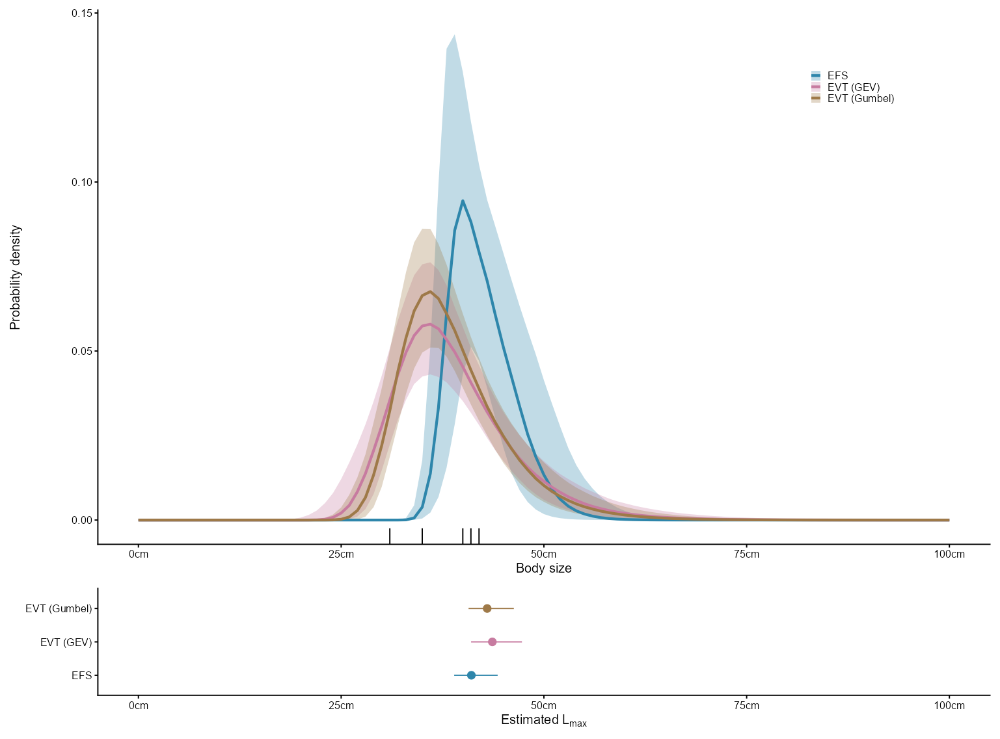

# fishmax 

The goal of fishmax provides a robust method to estimate the maximum
body length of fishes, with uncertanty. The packages uses two
approaches, the first is from Extreme Value Theory (EVT), which shows
that the maxima of a set of samples follows a specific distribution -
the Generalised Extreme Value (GEV) distribution. The second approach
uses knowledge on the underlying body size distribution to estimate the
likely parameters of the underlying distribution that would give rise to
the observed sample maxima. The two approaches are implemented using a
Bayesian Framework, for this you need to first install the cmdstanr R
package, and then install cmdstan, which is the backend C++ toolchain
that allows you to fit the bayesian models.

## Installation of cmdstan

<!-- maybe split into two chunks, install cmdstanr and then fishmax -->

Use of fishmax model fitting functions requires `cmdstan` to be
installed. You can install cmdstan directly from R using
`cmdstanr::install_cmdstan()`. To install cmdstanr and cmdstan:

``` r
install.packages(
  "cmdstanr",
  repos = c('https://stan-dev.r-universe.dev', getOption("repos"))
) # installs cmdstanr R package
cmdstanr::install_cmdstan() # installs cmdstan (C++ toolchain); may take several minutes
```

## Installation of fishmax

Then to install the fishmax package itself.

``` r
install.packages("remotes")
remotes::install_github("FreddieJH/fishmax") # installs fishmax
```

## Example

This is a basic example which shows you how to fit an EVT and EFS model
to a set of maxima values. Length maxima can either be in the from of a
vector, or a list of vectors (multiple maxima per sample)/

``` r
library(fishmax)

# five example sample maxima (e.g., max from five fishing competitions)
maxima_vector <- c(40, 41, 35, 42, 31) #cm

# the same five example samples, but where more information is known for each sample
maxima_list <- list(c(40, 39), 41, c(33, 34, 35), c(42, 40, 39), 31) #cm
```

### Model fitting

First step is to fit the maxima models. If it is the first time fitting
the models, they will first need to be compiled, this happens
automatically in the background but may take a few minutes. Once the
models are compiled the fitting proceedure will be much quicker.

``` r
# By default, when fitting to a vector of maxima (only maximum known per sample), it will fit the EVT (GEV), EVT (Gumbel), and EFS models.
fit_single <- fit_max_model(maxima_vector)


# By default, when fitting to a list of maxima (largest m known per sample), it will fit all models: EVT (GEV), EVT (Gumbel), EFS, and EFSMM models.
# Note that when fiting the models that can only take the maxima (EVT-GEV, EVT-Gumbel, and EFS), the models will only use the maximum from each sample
fit_mult <- fit_max_model(maxima_list)
```

### Get $L_{max}$ estimates

You can then obtain the estimates of $L_{max}$ from the models, chosing
the credible interval of choice (here we use 80% credible intervals),
and the 20-sample maxima. Here, we set $k$ to 20 (default value), to
estimate $L_{max}$ if we had 20 samples, this is an arbitrary number but
we recommend this value for consistency with other studies/analyses.
Note that this is **not** the number of sample maxima used to fit the
model.

``` r
# estimate the 20-sample Lmax, showing 80% credible intervals
get_lmax(fit = fit_single, ci = 0.8, k = 20)
```

<table>

<thead>

<tr>

<th style="text-align:left;">

model
</th>

<th style="text-align:right;">

max_fit.50.
</th>

<th style="text-align:right;">

max_lwr.10.
</th>

<th style="text-align:right;">

max_upr.90.
</th>

</tr>

</thead>

<tbody>

<tr>

<td style="text-align:left;">

EVT (GEV)
</td>

<td style="text-align:right;">

51.68184
</td>

<td style="text-align:right;">

44.61300
</td>

<td style="text-align:right;">

65.70633
</td>

</tr>

<tr>

<td style="text-align:left;">

EVT (Gumbel)
</td>

<td style="text-align:right;">

50.34146
</td>

<td style="text-align:right;">

43.90427
</td>

<td style="text-align:right;">

62.41632
</td>

</tr>

<tr>

<td style="text-align:left;">

EFS
</td>

<td style="text-align:right;">

45.04415
</td>

<td style="text-align:right;">

40.30297
</td>

<td style="text-align:right;">

54.33069
</td>

</tr>

</tbody>

</table>

### Check the model fit with traceplots

In Bayesian MCMC models, traceplots show the sequence of parameter
values sampled by the Markov chains over iterations. Each line
represents a separate chain. Good traceplots look like random,
stationary noise within a stable range, with all chains overlapping,
indicating that the chains have converged and are efficiently exploring
the posterior distribution. Visible trends, poor mixing between chains,
or chains stuck in different regions suggest lack of convergence or
sampling problems.

Each facet of the plot shows either a parameter traceplot, or the
traceplot of the log posterior density. The absolute value of the Log
posterior density is not important, and shouldn’t be compared between
models, but you are looking for convergence in the chains of the Log
posterior density to indicate that the model has converged properly.

``` r
# check to make sure there is convergence of the model parameters
plot_traceplot(fit_single)

# or if you only want to look at the EFS model
plot_traceplot(fit_single['efs'])
```

Example of a good-mixing in MCMC traceplot:


Example of potenital issues in MCMC traceplot, notice how chains are
struggling to converge on a parameter value:


### Visualise the $L_{max}$ estimates

By default we use the 80% bayesian credible intervals (argument = `ci`)
on the estimate of $L_{max}$, and we also report the ‘20-sample’
$L_{max}$ (argument = `k`). We recommend keeping these default values
for ease of comparison between analyses.

``` r
# visualise the PDF of the maximum for each sample (setting upper limit on x-axis to 100cm)
plot_fit(fit_single, xmax = 100, ci = 0.8, k = 20)
```


We can look at the 50% credible intervals:

``` r
# visualise the PDF of the maximum for each sample (setting upper limit on x-axis to 100cm)
plot_fit(fit_single, xmax = 100, ci = 0.5, k = 20)
```



Or estimate the ‘5-sample’ $L_{max}$ instead of the recommended
‘20-sample’ $L_{max}$, CIs are still at 50%

``` r
# visualise the PDF of the maximum for each sample (setting upper limit on x-axis to 100cm)
plot_fit(fit_single, xmax = 100, ci = 0.5, k = 5)
```


To produce quick-and-dirty plots you can reduce the resolution of the
x-axis ‘steps’, for example:

``` r
# visualise the PDF of the maximum for each sample (setting upper limit on x-axis to 100cm)
plot_fit(fit_single, xmax = 100, ci = 0.5, k = 5, xstep = 10)
```


## Extended applications

### Multiple species

You may have a situation where you have many species, and you wish to
estimate $L_{max}$ for each of them. Below is one method to achieve
this.

``` r

spp_maxima_list <-
  list(
    spp1_maxima = c(40, 41, 35, 42, 31),
    spp2_maxima = c(15, 23, 28, 25),
    spp3_maxima = c(40, 41, 39, 26, 43, 48, 50),
    spp4_maxima = c(12, 15, 14)
  )
spp_maxima_list_fits <- lapply(X = spp_maxima_list, FUN = fit_max_model)
spp_maxima_list_lmax <- lapply(
  X = spp_maxima_list_fits,
  FUN = get_lmax,
  ci = 0.8,
  k = 20
)
```
